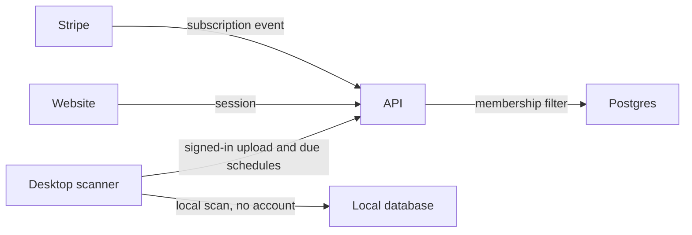

# feat: Finish SniffOutPro from sign-in through a signed installer

## Goal Capsule

Objective: A person can scan an authorized network on their own computer with no account, and a signed-in person can keep history, schedules, branded reports, and a private organization in the cloud, with a paid tier and a signed Windows installer.

Means: Build the remaining product gates in order on the existing monorepo, using the Supabase sign-in check that is already sketched (KTD1, KTD2).

Authority: Boss's latest word, then this plan, then `docs/GREENFIELD-SPEC.md` v2.1. The July handoff's "do not solo" line does not override KTD7.

Stop conditions:

- Do not re-scaffold. Phases 0–3 are already built.
- Do not lock cloud reads until the website and the desktop both send a signed-in session (U1 before U2).
- Do not deploy, push, or change production until Boss asks.
- Do not start paid checkout until Boss has connected a Stripe account (U8).
- Do not claim a macOS installer until Boss supplies an Apple certificate (U9).
- The website never scans a network. No exploit code.

Execution profile: one implementer, one unit at a time. A review of a unit is a separate chat. Ask before each commit. Test first where a unit changes a security boundary.

Tail: this plan. Progress stays outside the plan file.

## Product Contract

### Summary

SniffOutPro is a visual vulnerability assessment tool for authorized testing. The local scanner and the cloud dashboard already exist and were last proven on 2026-07-10. This plan finishes the product the spec calls done: accounts, schedules, consultant reports, separate organizations, a paid tier, a daily vulnerability-feed refresh, and a signed Windows installer.

### Problem Frame

The live dashboard still treats cloud reads as public, behind a rate limit. The shared sync secret is not a person's account. Schedules, reports, organizations, payment, and a signed installer are designed and partly sketched in the database, and they are not usable.

### Requirements

- R1. A person can create an account, sign in, and sign out on the website.
- R2. Cloud scan history, host lists, findings, diffs, and sync reject a caller who is not signed in.
- R3. The desktop scanner still runs a local lab scan with no account.
- R4. A signed-in workstation user can save a schedule, and the desktop runs it only when consent for those targets is already stored.
- R5. A consultant can produce a branded PDF from a synced scan.
- R6. Two organizations cannot see each other's scans, and an admin can invite a member.
- R7. The vulnerability cache refreshes on a daily job. Tests never call the live feed.
- R8. A paid subscription sets the tier, and the API refuses a feature above that tier.
- R9. A signed Windows installer runs the local fixture demo. A macOS installer waits on a certificate from Boss.
- R10. The health check stays public. The website never scans a network.

### Actors

- A1. Lab user. Runs the desktop scanner offline. No account.
- A2. Analyst. Signs in. History, diffs, and schedules.
- A3. Consultant. Analyst plus branded PDF reports.
- A4. Admin. Consultant plus organizations, invites, and isolation.
- A5. Stranger. No session. Can open the health check and the pricing page. Cannot read scans.

### Key Flows

- F1. Sign in and see only your scans. Covers R1, R2, R3.
- F2. Save a schedule and let the desktop run it later under stored consent. Covers R4.
- F3. Pick a client and a scan and download a branded PDF. Covers R5.
- F4. Two organizations, each blind to the other, with an invite. Covers R6.
- F5. Pay, and the tier follows the subscription. Covers R8.

### Acceptance Examples

- AE1. A stranger calling scan history is rejected. A signed-in analyst sees only scans in their organization. The desktop fixture scan still completes with no account.
- AE2. A schedule saved for targets that have no stored consent does not run. A schedule with stored consent runs on the desktop, not on the website.
- AE3. A consultant download includes the client name and logo. A workstation user is refused the report action.
- AE4. An admin in organization A cannot read organization B's scans, through the API and through a database role that is not the privileged app connection.
- AE5. After a test subscription event, `auth.me` returns the paid tier. A feature above that tier is refused. The health check still answers with no session.

### Success Criteria

- The four tiers in `packages/types/src/tiers.ts` are enforced in the API, not only hidden in the UI.
- Local `pnpm turbo run typecheck lint test` is green.
- Web dashboard tests cover signed-in and signed-out.
- No live network scan and no live vulnerability-feed call in CI.
- Production is unchanged until Boss asks for a deploy.

### Scope Boundaries

In scope: R1–R10, on the existing monorepo.

Out of scope:

- Exploit payloads, browser-based scanning, a mobile app, and a full template-library scanner. Already excluded by the spec.
- Proofhouse's package listing. Boss is doing that separately.
- Boss HQ. It stays a Claude Code cockpit.
- Re-scaffolding the monorepo.
- Product analytics. Tier gates do not depend on an analytics vendor. Add one only after Boss supplies a key.
- A macOS signed build, until Boss supplies the certificate.
- Pushing or deploying as part of finishing a unit.

### Dependencies

- The existing Supabase project and the production site. Last smoke was 2026-07-10. Re-check before any production change. Do not assume it is still healthy.
- A Stripe account, before U8.
- A Windows code-signing certificate, before the signed installer in U9.

### Outstanding Questions

- Q1. Deferred. What the four prices are. Boss sets them when U8 starts. The plan does not invent prices.
- Q2. Deferred. Whether Boss has an Apple signing certificate. U9 ships Windows either way.

No question here blocks U1.

### Sources

- `docs/GREENFIELD-SPEC.md` v2.1, especially the phase list and the definition of done.
- Repo state on 2026-10-08: `main` is clean. Last commit is 2026-07-10. The old path in `docs/HANDOFF.md` (`C:\Users\alkur\Projects\Sniffoutpro`) does not exist.

Product Contract preservation: bootstrap. The spec's meaning is carried forward. Scope was widened in this session from "accounts and schedules only" to the full remaining product.

## Planning Contract

### Key Technical Decisions

- KTD1. Use Supabase Auth for website sign-in. The API already resolves a bearer token against Supabase in `packages/api/src/auth/resolve-request-auth.ts`. Do not add a second identity vendor. (session-settled: user-directed — whole remaining product, including accounts, chosen over stopping after schedules.)
- KTD2. Cloud data procedures require a signed-in user. Retire the shared sync secret as the way the desktop uploads, once the desktop sends that user's session. Keep the production fail-closed behavior while the secret is still the only upload path. Governs R2, R3.
- KTD3. The tier lives on the user, not in `SNIFFOUT_TIER` for the whole server. The offline desktop with no account stays the personal tier. Governs R3, R8.
- KTD4. Organization isolation is enforced in the API by membership. Row-level security is added for a non-owner database role and tested as that role. The app's privileged connection does not count as proof of isolation. Governs R6.
- KTD5. Paid tiers use Stripe. The unit does not start until Boss connects an account. A license-key-only scheme was the smaller alternative and loses because this plan includes selling. Governs R8.
- KTD6. The signing gate is a Windows installer. macOS is the same unit's second half and stays blocked without a certificate. Governs R9.
- KTD7. One implementer, one unit at a time. Review in a separate chat. The July multi-agent handoff is historical. Ask Boss before each commit. Do not push.

### High-Level Technical Design

The website and the desktop share the API. Only the desktop scans. Schedules are stored in the cloud and executed on the desktop.

### Assumptions

- Supabase Auth is available on the existing project. If the project has no auth provider enabled, U1 stops and asks Boss to turn it on. That is a dashboard click, not a new vendor.
- `users.id` will match the Supabase auth user id. The table exists and does not yet store a tier.
- Tests inject `userId` and tier through the existing context. They do not call live Supabase, Stripe, or the vulnerability feed.
- The privileged database URL stays the API's connection. Isolation tests that claim row-level security use a separate restricted role.

### Sequencing

U1, then U2, then U3. U4 depends on U3. U5 depends on U3. U6 depends on U2 and U3. U7 can follow U3 and does not block reports. U8 depends on U3 and on Boss's Stripe account. U9 depends on U3 and on a Windows certificate, and it is last.

## Implementation Units

### U1. Website sign-in

Goal: A person can create an account, sign in, and sign out, and `auth.me` returns that person.

Requirements: R1, R10. Flow F1.

Files:

- `apps/web/src/app` for sign-in, sign-out, and the session
- `packages/api/src/routers/auth.ts`
- `packages/api/src/auth/resolve-request-auth.ts`
- `apps/web/src/app/api/trpc/[trpc]/route.ts`

Approach: Add the Supabase browser and server helpers. Sign-up and sign-in pages. When a person signs up, insert `users` with the auth user id as the primary key, not a fresh random id. The existing bearer lookup stays the API's check. The website session is a same-origin cookie. The desktop keeps sending a bearer. Do not turn on credentialed cookies against the current wildcard cross-origin header. `auth.me` also returns email once the user row exists. Health stays public.

Test scenarios:

- A request with no bearer leaves `userId` null and `auth.me` rejects.
- A mocked Supabase user response sets `userId` to that id.
- A bad or unreachable auth response leaves `userId` null and does not throw out of the resolver.
- The health route still answers with no session.

Verification: `pnpm --filter @sniffoutpro/api test` and `pnpm --filter @sniffoutpro/web test`.

### U2. Close cloud data to signed-in users

Goal: Strangers cannot read or upload scans. The desktop uploads as the signed-in user. The local scanner still works offline.

Requirements: R2, R3. Flow F1. Acceptance AE1.

Files:

- `packages/api/src/routers/scans.ts`
- `packages/api/src/routers/hosts.ts`
- `packages/api/src/routers/findings.ts`
- `packages/api/src/lockdown.test.ts`
- `apps/desktop/src/lib/sync-scan.ts`
- `apps/web/src/app/dashboard/page.tsx`

Approach: Switch cloud reads from the public procedure to the protected one. Upload requires the signed-in user, not the shared secret. Update the lockdown test so it expects rejection, and delete the placeholder that only records "not done yet." Ship the desktop and dashboard session change in the same unit so the product is not locked with no way in.

Test scenarios:

- Scan list, detail, diff, hosts, and findings reject a null user.
- Sync rejects a null user even when the old shared secret would have matched.
- Sync accepts a context with a user id and stores the scan.
- The desktop fixture scan path does not call the network.
- Dashboard tests cover signed-out (rejected) and signed-in (list renders).

Verification: `pnpm --filter @sniffoutpro/api test` and `pnpm --filter @sniffoutpro/desktop test`.

### U3. Per-user tier

Goal: The API allows or refuses a feature from the signed-in user's tier.

Requirements: R3, R8.

Files:

- `packages/db/src/schema/index.ts`
- a new migration under `packages/db/drizzle`
- `packages/api/src/trpc.ts`
- `apps/web/src/app/api/trpc/[trpc]/route.ts`
- `packages/types/src/tiers.ts`

Approach: Add a tier column on `users`, defaulting a new signed-in user to workstation. Stop reading `SNIFFOUT_TIER` as the tier for every request. Add a procedure wrapper that refuses a feature the tier does not include, using `hasTierFeature`. Offline desktop with no session stays personal and never hits these routes.

Test scenarios:

- A workstation user is refused a report feature.
- A consultant user passes the same check.
- A missing user row does not default the whole server to workstation.
- Existing tier unit tests still pass.

Verification: `pnpm --filter @sniffoutpro/db test` and `pnpm --filter @sniffoutpro/api test`.

### U4. Schedules that run on the desktop

Goal: An analyst can save a schedule, and the desktop runs due jobs only with stored consent.

Requirements: R4, R10. Flow F2. Acceptance AE2.

Files:

- `packages/api` new scan-job router beside `packages/api/src/routers`
- `packages/db/src/schema/index.ts` (`scanJobs` already exists)
- `apps/desktop/src` poller next to the scan runner

Approach: Create, list, update, and disable jobs for the caller's organization. The desktop polls due jobs and runs them locally. Refuse a run when consent for those targets is missing. The website has no scan button.

Test scenarios:

- Creating a job without the schedules feature is refused.
- Listing returns only the caller's jobs.
- A due job with no matching consent is skipped.
- A due job with consent is handed to the local runner.
- No website route invokes nmap.

Verification: `pnpm --filter @sniffoutpro/api test` and `pnpm --filter @sniffoutpro/desktop test`.

### U5. Branded PDF reports

Goal: A consultant downloads a branded PDF for a synced scan. A workstation user cannot.

Requirements: R5. Flow F3. Acceptance AE3.

Files:

- `packages/api` report router
- `packages/db/src/schema/index.ts` (`clientProfiles`, `reportTemplates` already exist)
- `apps/web/src/app` reports page

Approach: Client and template create/list/update for the caller's organization. Logo file goes to Supabase Storage. The PDF is built on the server from the stored scan, with the client name and logo. Refuse the action below consultant.

Test scenarios:

- Workstation tier is refused.
- Consultant tier gets a PDF whose text includes the client name.
- A scan from another organization is refused.
- A missing logo still produces a PDF without crashing.

Verification: `pnpm --filter @sniffoutpro/api test`.

### U6. Organizations that cannot see each other

Goal: An admin invites a member, and two organizations cannot read each other's scans.

Requirements: R6. Flow F4. Acceptance AE4.

Files:

- `packages/api` organization router
- `packages/db/drizzle` new row-level security migration
- `packages/api` scan queries that filter on membership

Approach: Organization create, invite, and role change for admins. Every scan read and write checks membership. Add row-level policies for a non-owner role. Prove isolation with that role, not with the privileged app connection.

Test scenarios:

- Admin of A cannot list B's scans.
- An analyst invite can read A and cannot admin A.
- A viewer cannot create a schedule or a report.
- A restricted database role cannot select B's rows.
- The privileged connection is not used as the only isolation test.

Verification: `pnpm --filter @sniffoutpro/api test` and `pnpm --filter @sniffoutpro/db test`.

### U7. Daily vulnerability-cache refresh

Goal: The existing daily job writes real cache rows from the public feed. CI uses a fixture.

Requirements: R7.

Files:

- `packages/api/src/jobs/cve-sync.ts`
- `apps/web/src/app/api/inngest/route.ts`
- a fixture under `packages/api` tests

Approach: Replace the stub that only returns "accepted" with a parser for the feed's current JSON, writing `cveCache`. The test loads the fixture. The job records the last sync time. A network failure leaves the previous cache in place.

Test scenarios:

- The fixture produces at least one cache row with an id and a score.
- A failed fetch does not delete existing rows.
- The test process makes no outbound call.

Verification: `pnpm --filter @sniffoutpro/api test`.

### U8. Paid tier through Stripe

Goal: A subscription sets the user's tier, and the API follows it.

Requirements: R8. Flow F5. Acceptance AE5.

Files:

- `apps/web/src/app` pricing page
- `packages/api` subscription webhook
- `packages/db` subscription fields on the user or a small subscription table

Approach: Do not start until Boss connects Stripe. Prices come from Boss (Q1). The webhook sets the tier. A canceled subscription drops to workstation, not to a broken null. The pricing page lists the four tiers. No analytics vendor.

Test scenarios:

- A signed test event for the consultant price sets the tier to consultant.
- `auth.me` returns that tier.
- A report call then succeeds, and an admin-only call still fails.
- A canceled event drops the tier and the report call fails again.
- An unsigned webhook is rejected.

Verification: `pnpm --filter @sniffoutpro/api test`.

### U9. Signed Windows installer and the docs a stranger needs

Goal: A signed Windows installer runs the local fixture demo, and the docs match the product.

Requirements: R9, R3.

Files:

- `apps/desktop` Tauri bundle config
- `docs/HANDOFF.md`
- `docs/DEMO-G2.md`
- new user and operator docs under `docs/`

Approach: Do not start the signed build until Boss supplies the Windows certificate (KTD6). The unsigned local build can be proven earlier. Update the handoff so it points at this plan and stops sending people to the deleted folder and the July swarm. User docs cover install, consent, sync, and the rule that this tool does not exploit. macOS signing stays a note until Q2 is answered.

Test scenarios:

- The fixture demo steps in `docs/DEMO-G2.md` still match the desktop UI.
- The handoff no longer names the deleted folder as the repo.
- CI still does not run a live scan.

Verification: `pnpm turbo run typecheck lint test` from the repo root, plus the desktop fixture test.

## Verification Contract

From the repo root:

- `pnpm turbo run typecheck lint test`
- `pnpm --filter @sniffoutpro/web test:e2e` after U1 and U2

Per unit, run that unit's package test before the full turbo run.

Not in CI: live nmap, live vulnerability-feed calls, live Stripe, live Supabase.

Production smoke (`pnpm prod:verify`) runs only after Boss asks for a deploy, and only against the site he names.

## Definition of Done

The plan is done when:

- R1–R9 are true in the product. R10 stayed true throughout.
- U8 has either shipped against Boss's Stripe account or is explicitly stopped because that account is not connected. It is not silently skipped.
- U9 has a signed Windows installer, or is explicitly stopped because the certificate is not available. The unsigned demo still passes.
- `pnpm turbo run typecheck lint test` exits 0.
- Abandoned experiments are not left in the diff.
- No secrets, tokens, or personal details are committed.
- `docs/HANDOFF.md` points at this plan.

## Appendix

External vendor docs were not re-fetched. The spec and the code already name Supabase Auth, Stripe, and Tauri signing. A fresh survey would not change the sequence. If U1 finds the Supabase project has auth disabled, stop and ask Boss.
