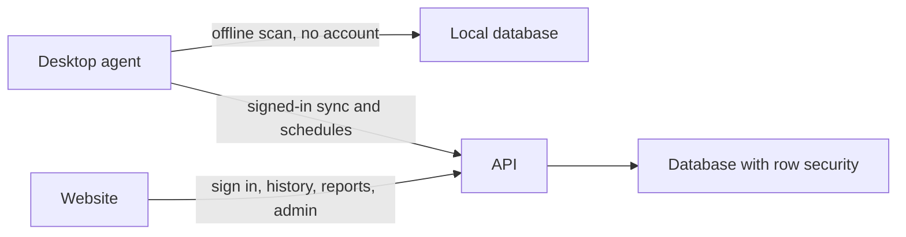

# feat: Finish SniffOutPro through a shippable product

## Goal Capsule

- Objective: A person can scan an authorized network on the desktop with no account, and a signed-in customer can keep history, run schedules, export a branded report, manage an organization, and install a signed Windows app whose paid tier matches what they bought.
- Means: Build the remaining gates in the existing monorepo, in order, on the tables and procedure helpers that already exist (KTD1, KTD2).
- Authority: Boss's chat words, then this plan, then `docs/GREENFIELD-SPEC.md` v2.1. The July handoff that says to spawn a swarm is historical.
- Execution profile: One implementer per unit. A review of a unit happens in a later chat, not in the chat that wrote it. Push, deploy, and live database changes wait for Boss.
- Stop conditions: Do not re-scaffold. Do not flip the live site to require sign-in until the website login and the desktop sign-in both work locally. Do not run a live network scan in CI. Stop and ask before creating a Stripe account, a code-signing certificate, or a macOS build (KTD4, KTD5).
- Tail: The last unit updates the resume docs so the next session does not follow the July "uncommitted" handoff.

## Product Contract

### Summary

SniffOutPro already scans locally and shows a cloud dashboard. This plan finishes it: accounts, schedules, consultant reports, organizations that cannot see each other, a price page with a license that sets the tier, and a signed Windows installer. The free local scanner keeps working with no account.

### Problem Frame

The live app last changed on 2026-07-10. Cloud reads are still open to anyone who can reach the site, limited only by a rate limit. The spec's definition of done is four tiers that the server actually enforces, plus a signed install. Until that exists, the product is a lab demo with a public dashboard.

### Requirements

Accounts and schedules

- R1. The website has sign-up, sign-in, and sign-out. A signed-in caller can read who they are and which tier they are on.
- R2. Cloud history, findings, diffs, and sync reject a caller who is not signed in. The health check stays public. The free desktop scanner still runs offline with no account and does not call the cloud.
- R3. A signed-in workstation user can create, list, enable, and disable a scheduled scan. The desktop runs a due job only with the consent already stored for those targets.

Reports

- R4. A consultant can save a client profile and a report template, including a logo, and export a PDF from a synced scan that shows that branding.
- R5. A workstation tier cannot create reports. The server rejects the call. The screen does not offer the action.

Organizations

- R6. An admin can create an organization, invite a member, and assign admin, analyst, or viewer. A viewer cannot start a sync or a schedule.
- R7. Two organizations cannot read each other's scans, hosts, findings, or reports. The database enforces that, not only the app.

Commercial ship

- R8. A pricing page shows the four tiers and what each one can do. A license key sets the tier on the server. A missing or bad key stays on the free local tier.
- R9. A clean Windows machine can install a signed desktop build, run the fixture scan, and update from the update channel.
- R10. A support runbook and a short public doc tell an operator how to install, authorize a scan, sync, and get help. Creator docs match the repo as it is after this plan.

### Key decisions

- Finish through commercial ship (session-settled: user-directed — chosen over stopping at accounts and schedules: Boss selected the whole remaining spec). Governs R1 through R10.
- Proofhouse's package listing and Boss HQ are not part of this product (session-settled: user-directed — chosen over folding them into this plan).

### Actors

- A1. Hobbyist on the free local tier, no account.
- A2. Signed-in analyst on the workstation tier.
- A3. Consultant who exports branded reports.
- A4. Organization admin.
- A5. Viewer inside an organization.

### Key Flows

- F1. Offline scan
  - Trigger: A1 opens the desktop app with no account.
  - Steps: They consent, run the fixture or a local scan, and see topology and findings. Nothing is uploaded.
  - Outcome: A local history exists only on that machine.
  - Covered by: R2
- F2. Sign in and sync
  - Trigger: A2 signs in on the website and on the desktop.
  - Steps: They sync a completed scan. An anonymous caller tries the same cloud read.
  - Outcome: A2 sees the scan in the dashboard. The anonymous caller is refused.
  - Covered by: R1, R2
- F3. Schedule
  - Trigger: A2 saves a schedule for targets they already consented to.
  - Steps: The desktop notices the job is due and runs it. A disabled job does not run.
  - Outcome: The new scan appears in history.
  - Covered by: R3
- F4. Branded report
  - Trigger: A3 picks a client, a template, and a synced scan.
  - Steps: They export a PDF. A2 calls the same action.
  - Outcome: A3 gets a branded PDF. A2 is refused.
  - Covered by: R4, R5
- F5. Two organizations
  - Trigger: A4 invites an analyst. A second org exists.
  - Steps: Each org syncs a scan. Each tries to open the other's scan.
  - Outcome: Each org sees only its own. A viewer cannot sync.
  - Covered by: R6, R7
- F6. Paid install
  - Trigger: A customer installs the signed Windows app and enters a license.
  - Steps: The server sets the tier. A bad key does not upgrade them.
  - Outcome: The tier matches the key, and the fixture scan still runs.
  - Covered by: R8, R9

### Acceptance Examples

- AE1. Anonymous cloud read
  - Covers: R2
  - Given: No session.
  - When: The caller asks for scan history.
  - Then: The call is refused, and the health check still answers.
- AE2. Free desktop
  - Covers: R2
  - Given: No account.
  - When: The desktop runs the fixture scan.
  - Then: Findings show locally and no cloud call is required.
- AE3. Schedule list
  - Covers: R3
  - Given: A signed-in workstation user.
  - When: They create a schedule and list schedules.
  - Then: The new schedule is in the list, and a disabled one does not run.
- AE4. Consultant PDF
  - Covers: R4, R5
  - Given: A synced scan and a template with a logo.
  - When: A consultant exports, and a workstation user tries the same.
  - Then: Only the consultant receives a PDF that shows the logo.
- AE5. Org isolation
  - Covers: R7
  - Given: Two orgs, each with one scan.
  - When: Org A asks for org B's scan, including by guessing the id.
  - Then: Org A gets nothing, and the database policy is what refuses it.
- AE6. License
  - Covers: R8
  - Given: A signed-in free user.
  - When: They submit a valid consultant key, then a garbage key.
  - Then: The valid key sets the consultant tier. The garbage key leaves the tier unchanged.
- AE7. Signed install
  - Covers: R9
  - Given: A Windows machine without the repo.
  - When: They install the signed build and run the fixture demo.
  - Then: The fixture scan completes, and the installer is signed.

### Success Criteria

- The free local path in `docs/DEMO-G2.md` still completes.
- Anonymous cloud reads of history fail. Health still answers.
- A consultant PDF and a two-org isolation test exist and pass.
- A license key changes the tier. A bad key does not.
- A signed Windows installer is produced, or the unit stops with the missing certificate named. It does not pretend the installer exists.
- `pnpm turbo run typecheck lint test` exits 0 on the branch.

### Scope Boundaries

In this plan: R1 through R10, in the order of the units below.

Deferred for later, still inside the product identity, blocked on Boss or a machine this repo does not have:

- Stripe checkout. The spec allows a license key or Stripe. This plan ships the license key. Stripe starts only after Boss says a Stripe account is ready (KTD4).
- macOS signed build. This machine is Windows. The macOS unit stops until a Mac or a macOS build runner exists (KTD5).
- Push, production deploy, and production database changes. Each waits for an explicit yes.

Outside this product's identity (from the spec): exploit payloads, Nessus or OpenVAS compatibility, scanning from the browser or the cloud, a mobile app, a full nuclei template library, and streaming live scan progress to the website.

Not this plan: Proofhouse's public package listing. Boss HQ.

### Dependencies

- The existing Supabase project and the Vercel app stay the targets. No second stack.
- Desktop scans stay on the desktop. The website never scans a network.
- CI stays fixture-only.

### Outstanding Questions

- Q1. Stripe account — deferred, not blocking. License key ships either way.
- Q2. macOS signing host — deferred, not blocking the Windows installer.
- Q3. Code-signing certificate for Windows — deferred until U12. The unit stops and asks rather than inventing a cert.

### Sources

- `docs/GREENFIELD-SPEC.md` v2.1, especially the phase gates and the definition of done.
- `docs/HANDOFF.md` and `docs/PHASE-LOG.md` for what was true on 2026-07-10. The "uncommitted hardening" warning is stale: `main` is clean and the hardening commit is `da9b14d`.
- Code: `packages/api/src/trpc.ts`, `packages/api/src/lockdown.test.ts`, `packages/api/src/routers/`, `packages/db/src/schema/index.ts`.
- External research was not run. Auth, tiers, and tables already have local shapes. Stripe and macOS signing are stop-gates instead of a guessed integration.

## Planning Contract

### Key Technical Decisions

- KTD1. Keep the current procedure split. `protectedProcedure` already refuses a missing user. Cloud history moves onto it. `syncProcedure` stays the extra gate for sync, and it must also require a user, not only the shared sync token. Health stays public. The free desktop never needs either gate.
- KTD2. Use the tables already in `packages/db/src/schema/index.ts` (`organizations`, `users`, `memberships`, `scan_jobs`, `client_profiles`, `report_templates`). Add columns or policies only where a unit's test cannot pass without them. Do not create a parallel schema.
- KTD3. Supabase Auth is the sign-in system, because the database is already Supabase. The app's `users` row is linked to that auth user. No second password store.
- KTD4. Tier assignment ships as a server-checked license key (session challenge of the whole-product directive: a Stripe account is not in the repo, and inventing one is an external account Boss has not opened). Stripe is the deferred alternative, not a silent substitute. (session-settled: user-directed scope includes pricing — chosen over dropping commercial ship: the license key is how pricing ships without a new vendor.)
- KTD5. The signed installer in this plan is Windows. macOS is a stop-gate, not a faked build. (Same challenge: this computer cannot sign a Mac app.)
- KTD6. One implementer works a unit, then a different chat reviews it. The July multi-agent swarm is not the execution model.
- KTD7. Row security on the tenant tables is the isolation mechanism for R7. An app-only filter is not enough, because a guessed id must still return nothing.
- KTD8. Do not change the live site until U1 and U3 pass locally. Flipping cloud reads first would blank the current dashboard.

### High-Level Technical Design

The desktop is the only scanner. The website is the account, history, report, and admin surface. The database, not the page, is what hides one organization from another.

### Assumptions

- The Supabase project from the July deploy is still the one to use.
- `packages/types` does not yet export a tier helper. U4 adds it if it is missing.
- PostHog is optional wiring: flags mirror the server tier, and a missing key does not change what the server allows.
- The placeholder test that asserts "lockdown is pending" is replaced, not left green by weakening it.

### Sequencing

U1 and U2 and U3 land before any live flip. U4 before reports and admin. U6 before U7. U8 before U9. U10 after tiers exist. U12 after the desktop still passes the fixture demo. U13 and the Stripe follow-up wait on Boss. U14 and U15 are last so the docs describe what shipped.

## Implementation Units

| U-ID | Title                     | Files                                                           | Depends on  |
| ---- | ------------------------- | --------------------------------------------------------------- | ----------- |
| U1   | Website sign-in           | `apps/web`, `packages/api/src`                                  | —           |
| U2   | Close cloud reads         | `packages/api/src/routers`, `packages/api/src/lockdown.test.ts` | U1          |
| U3   | Desktop signs in to sync  | `apps/desktop`                                                  | U1          |
| U4   | Tier gate                 | `packages/types`, `packages/api/src`                            | U2          |
| U5   | Schedules                 | `packages/api/src`, `apps/desktop`                              | U3, U4      |
| U6   | Client and template       | `packages/api/src`, `apps/web`                                  | U4          |
| U7   | Branded PDF               | `apps/web`, `packages/api/src`                                  | U6          |
| U8   | Organizations and invites | `packages/api/src`, `apps/web`                                  | U4          |
| U9   | Row security              | `packages/db`                                                   | U8          |
| U10  | Pricing and license       | `apps/web`, `packages/api/src`                                  | U4          |
| U11  | Tier flags                | `apps/web`                                                      | U10         |
| U12  | Signed Windows install    | `apps/desktop`                                                  | U3          |
| U13  | macOS signing stop-gate   | `apps/desktop`                                                  | U12         |
| U14  | Public docs and runbook   | `docs`                                                          | U7, U9, U12 |
| U15  | Resume docs               | `docs/HANDOFF.md`, `docs/PHASE-LOG.md`                          | U14         |

### U1. Website sign-in

- Goal: A person can create an account, sign in, sign out, and see their tier.
- Requirements: R1
- Files: `apps/web` sign-in screens, Supabase browser client, `packages/api/src` context that sets `userId` from the session, `packages/api/src/routers/auth.ts`
- Approach: Supabase Auth (KTD3). Link the auth user to `users`. `auth.me` keeps using `protectedProcedure`.
- Test scenarios:
  - Happy path: a new email signs up, signs in, and `auth.me` returns that user and the free tier.
  - Error: a wrong password does not create a session.
  - Edge: signing out makes the next `auth.me` fail.
  - Integration: the API context receives the same user id the website session has.
- Verification: the auth tests and `pnpm turbo run typecheck lint test`.

### U2. Close cloud reads

- Goal: History, findings, and diffs require a signed-in user. Health stays public.
- Requirements: R2
- Files: `packages/api/src/routers/scans.ts`, `packages/api/src/routers/hosts.ts`, `packages/api/src/routers/findings.ts`, `packages/api/src/lockdown.test.ts`
- Approach: Move those reads onto `protectedProcedure` (KTD1). Replace the test that currently expects lockdown to stay pending.
- Test scenarios:
  - Happy path: a caller with a user id can list their scans.
  - Error: a caller with no user id is refused on list, detail, diff, hosts, and findings.
  - Edge: health still answers with no user.
  - Integration: the old "lockdown pending" assertion is gone and the refusal assertions pass.
- Verification: `packages/api` tests, then the turbo suite.

### U3. Desktop signs in to sync

- Goal: The desktop syncs as the signed-in user. The free local scan still needs no account.
- Requirements: R2
- Files: `apps/desktop` sync and session UI, the API sync path
- Approach: Sync requires a user plus the existing sync authorization (KTD1). Personal mode never calls the cloud. Do not deploy this flip until local sign-in works (KTD8).
- Test scenarios:
  - Happy path: a signed-in desktop syncs a fixture scan and the dashboard can read it as that user.
  - Error: sync with no user is refused even if a shared token is present.
  - Edge: fixture scan with no account writes locally and makes no cloud call.
  - Integration: an anonymous dashboard read of that scan fails after U2.
- Verification: desktop fixture test plus API sync test.

### U4. Tier gate

- Goal: The server refuses a feature the caller's tier does not include.
- Requirements: R5
- Files: `packages/types/src/tiers.ts` if missing, API tier middleware, a test next to the other API tests
- Approach: One helper maps tier to features. Procedures declare the feature they need. The UI hides what the server would refuse, and the server still refuses.
- Test scenarios:
  - Happy path: a consultant caller passes a report-gated procedure's auth check.
  - Error: a workstation caller gets a forbidden response on that procedure.
  - Edge: a missing tier is treated as the free tier, not as admin.
  - Integration: `auth.me` includes the tier the middleware uses.
- Verification: new tier tests and the turbo suite.

### U5. Schedules

- Goal: A workstation user can save a schedule and the desktop runs it when due, using stored consent.
- Requirements: R3
- Files: a scan-jobs router under `packages/api/src/routers`, `apps/desktop` poller, `packages/db/src/schema/index.ts` only if a column is missing for consent linkage
- Approach: CRUD on the existing `scan_jobs` table. The poller refuses targets that have no stored consent.
- Test scenarios:
  - Happy path: create a job and list it back.
  - Error: a viewer or an anonymous caller cannot create one.
  - Edge: a disabled job is skipped by the poller.
  - Integration: a due job for consented targets runs the fixture path and writes a scan.
- Verification: API job tests and a desktop poller test.

### U6. Client and template

- Goal: A consultant can save a client and a branded template, including a logo.
- Requirements: R4
- Files: routers for `client_profiles` and `report_templates`, `apps/web` screens, Supabase Storage for the logo
- Approach: Consultant tier only (U4). Logo is a stored file, not a data URL in the row.
- Test scenarios:
  - Happy path: create a client and a template and list them.
  - Error: a workstation caller is forbidden.
  - Edge: a template with no logo still saves.
  - Integration: the logo URL on the template points at the stored file.
- Verification: API tests for both routers.

### U7. Branded PDF

- Goal: A consultant exports a PDF of a synced scan that shows their logo and colors.
- Requirements: R4, R5
- Files: report export on the API or web server, `apps/web` reports screen
- Approach: The PDF includes an executive summary, the finding table, and the branding from U6. No scan is run during export.
- Test scenarios:
  - Happy path: export returns a PDF whose text includes the client name and a finding title from the fixture scan.
  - Error: a workstation caller is forbidden.
  - Edge: a scan with zero findings still exports a PDF that says there are none.
  - Integration: the template logo is referenced by the export.
- Verification: a report test with the fixture scan, plus the web typecheck.

### U8. Organizations and invites

- Goal: An admin can create an organization, invite a member, and set admin, analyst, or viewer.
- Requirements: R6
- Files: org and membership routers, `apps/web` admin screens
- Approach: Roles on the existing `memberships` table. Viewer cannot sync or schedule.
- Test scenarios:
  - Happy path: admin creates an org and an analyst sees it.
  - Error: a viewer sync is refused.
  - Edge: inviting an email that already has an account attaches that user instead of duplicating them.
  - Integration: `auth.me` reflects the membership role.
- Verification: membership tests.

### U9. Row security

- Goal: One organization cannot read another's rows, even with a guessed id.
- Requirements: R7
- Files: `packages/db` migration SQL and a database integration test
- Approach: Enable row security on tenant tables and policies tied to membership (KTD7). Ship the SQL in the repo. Apply it to production only after Boss says yes.
- Test scenarios:
  - Happy path: a member reads their org's scan.
  - Error: the other org's scan id returns no row under the database role the API uses.
  - Edge: a user with no membership reads no tenant rows.
  - Integration: the app list and the direct id lookup agree.
- Verification: database integration test against local Postgres. Do not point this test at production.

### U10. Pricing and license

- Goal: The pricing page matches the four tiers, and a license key sets the tier.
- Requirements: R8
- Files: `apps/web` pricing page, a license check on the API, a place to store the key's tier
- Approach: Server-side check (KTD4). A bad key does not change the tier. No Stripe calls in this unit.
- Test scenarios:
  - Happy path: a valid consultant key sets the tier to consultant.
  - Error: a garbage key leaves the previous tier in place.
  - Edge: an empty key is treated as free.
  - Integration: after a valid key, a report call that U4 would refuse for workstation now passes the tier check.
- Verification: license tests and a pricing page test that the four tiers are listed.

### U11. Tier flags

- Goal: Optional product flags mirror the server tier and cannot grant a feature the server would refuse.
- Requirements: R5, R8
- Files: `apps/web` flag reader
- Approach: If the flag key is missing, the UI follows `auth.me`'s tier. A flag that says yes while the tier says no still hits the server refusal.
- Test scenarios:
  - Happy path: with no flag key, the UI shows the features of the `auth.me` tier.
  - Error: a tampered flag does not make a workstation report call succeed.
  - Edge: a missing key does not throw during page load.
- Verification: a web test with the key unset.

### U12. Signed Windows install

- Goal: A signed Windows installer runs the fixture scan on a machine that does not have the repo.
- Requirements: R9
- Files: `apps/desktop` Tauri bundle config and the update channel config
- Approach: Stop and ask when the signing certificate is missing (Q3). Do not commit the certificate. CI still does not run a live network scan.
- Execution note: The first proof is a smoke install of the fixture demo, not a unit test of the certificate.
- Test scenarios:
  - Happy path: the bundled app completes the fixture scan from `docs/DEMO-G2.md`.
  - Error: the build fails closed when the certificate is absent, with a message that names what is missing.
  - Edge: the unsigned local dev build still runs for development.
- Verification: desktop fixture test, plus the smoke note recorded in `docs/PHASE-LOG.md` when Boss has the certificate.

### U13. macOS signing stop-gate

- Goal: Record whether a macOS signed build can be produced.
- Requirements: R9
- Files: `apps/desktop` bundle notes only if a runner exists
- Approach: If no Mac runner is configured, stop and write that in the phase log (KTD5). Do not check in a fake signed artifact.
- Test expectation: none — this unit is a gate, not a feature, until a runner exists.
- Verification: the phase log says either the runner result or the stop reason.

### U14. Public docs and runbook

- Goal: A new person can install, authorize a scan, sync, and know who to ask.
- Requirements: R10
- Files: `docs` user guide and a support runbook
- Approach: Commands in the docs are ones the repo actually runs. No personal email, city, or family details in anything that will be published.
- Test scenarios:
  - Happy path: the install steps match the Windows bundle from U12.
  - Error: the runbook says what to do when sign-in fails, without pasting a secret.
- Verification: a read-through against the current scripts. No new test framework.

### U15. Resume docs

- Goal: The next session trusts the new plan instead of the July swarm handoff.
- Requirements: R10
- Files: `docs/HANDOFF.md`, `docs/PHASE-LOG.md`
- Approach: Point the resume section at this plan and the next unfinished unit. Delete nothing from the phase log; append.
- Test expectation: none — docs only.
- Verification: `docs/HANDOFF.md` no longer says the hardening commit is uncommitted, and it names this plan.

## Verification Contract

| Check                   | Command                                                               | When                               |
| ----------------------- | --------------------------------------------------------------------- | ---------------------------------- |
| Types, lint, tests      | `pnpm turbo run typecheck lint test`                                  | After every unit that changes code |
| API lockdown            | `pnpm --filter @sniffoutpro/api test`                                 | U2, U4, U5, U8, U10                |
| Web                     | `pnpm --filter @sniffoutpro/web test`                                 | U1, U7, U11                        |
| Local database policies | `pnpm --filter @sniffoutpro/db` migration test against local Postgres | U9                                 |
| Production smoke        | `node scripts/verify-production.mjs` against the live URL             | Only after Boss says deploy        |
| Fixture demo            | `docs/DEMO-G2.md`                                                     | U3 and U12                         |

Do not run nmap against a network in CI. Do not print or commit tokens, database URLs, or license private keys.

## Definition of Done

- R1 through R10 are true, or a deferred question names the Boss-owned blocker (certificate, Mac runner, Stripe).
- AE1 through AE7 pass, with AE7 allowed to stop at the named missing certificate instead of a fake installer.
- The turbo suite exits 0.
- Abandoned experiments are not left in the diff.
- `docs/HANDOFF.md` points at this plan.
- No secrets and no personal contact details in the published docs.
- The live site is unchanged until Boss asks for a deploy after U1 and U3 are green locally.

## Appendix

The July orchestration doc `docs/MULTI-AGENT-HANDOFF.md` still says the branch is uncommitted and that one agent must not finish phases 4 through 7. Git history shows the hardening landed in `da9b14d` on 2026-07-10, and `main` was clean when this plan was written. This plan replaces that execution model with KTD6.
